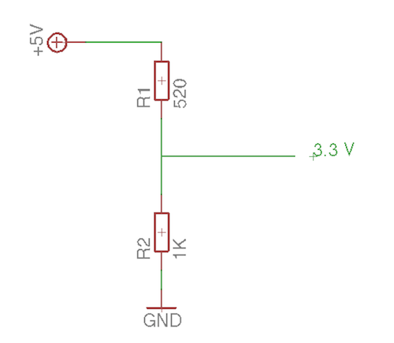

# ADF4351-Arduino-LCDSHIELD

First release of Arduino sketch to drive ADF4351 module from SV1AFN

See sketch for wiring details and other things :)

pinout: 

Arduino A4 -> 7 (MUX) 
Arduino 13 -> 1 (CLK) 
arduino 11 -> 4 (DATA) 
Arduino 3  -> 3 (LE) 

Remember to use 3.3V as source for the ADF4351 module (pin 7 vcc and pin 5 as GND)and a voltage divider for signals:

If you are using a 3.3V microcontroller like for example Arduino DUE, or Teensy boards, you probably don't need this.

 
<b>Feature:</b>

-Frequency from 34 Mhz to 4400 Mhz 
-EEprom saving and readings (automatically on startup on memory 0) 

To set frequency move cursor with LEFT/RIGHT and press UP/DOWN to change value. If you move cursor to REE use UP/DOWN to set WEE (Read and Write). 

To use memories move cursor to memory number and press UP/DOWN to select memomry (new frequency will be tuned immediatly). 

To Store a new memory select number, set WEE and press "SELECT" for 2 seconds. That's all.  

<b>To do :</b>

-Better Interface  
-Output power handling  
-Rotative Encoder  
-Support for other displays

73
Giorgio IZ2XBZ

